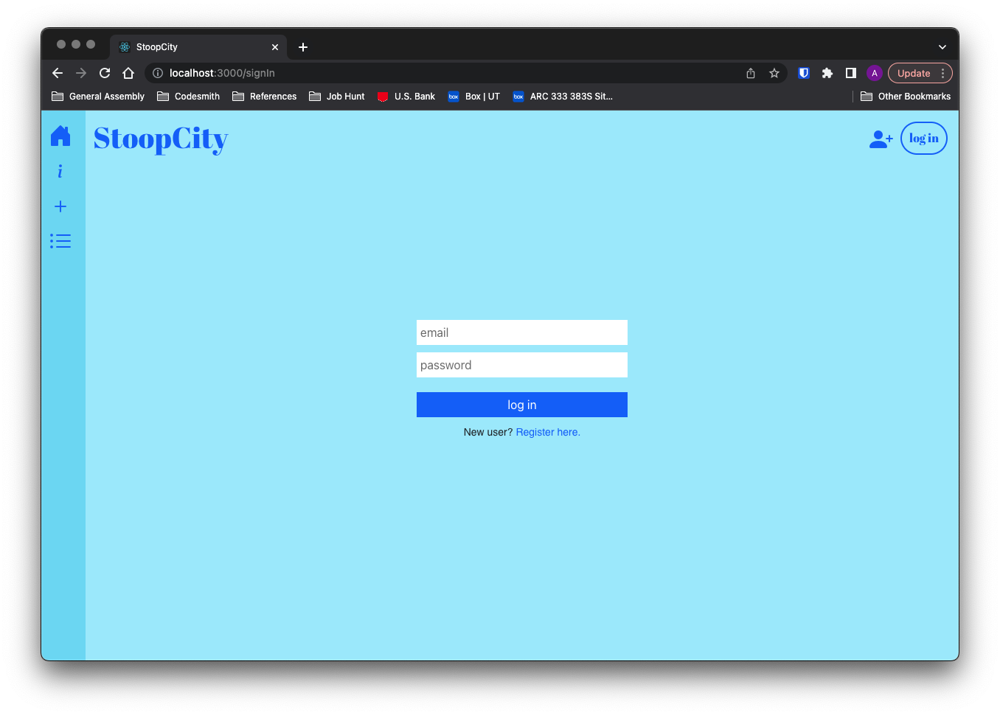

# StoopCity

## Date: 12/8/2022

### Author: Amaya Lucas

#### [Trello](https://trello.com/b/nR7a5R8c/capstone) || [GitHub](https://github.com/ajluc) | [LinkedIn](https://www.linkedin.com/in/amaya-lucas/)

---

### **_Description_**

In an effort to reduce waste of goods that are still usable, "Stooping" has become a powerful movement in the city of New York. Anyone in the community can post furniture, clothes, books, etc that they see left on street corners and stoops in case any members can give those items a second life. Typically done via several popular Instagram pages, this web app organizes posts on a map for users to more easily see what items are nearby to them.

---

### **_Technologies Used_**

1. Flask
2. SQLAlchemy
3. Javascript
4. HTML
5. CSS
6. MapboxGL
7. Bootstrap/Reactstrap

---

### **_Getting Started_**

On the home page, view a map with active Stoops. Click each Stoop to view the full posting with details and photos. Visitors can create their own user, post Stoops that they see out in the wild, edit/delete their posts, or mark others' Stoops as "collected" if they find that the item has been taken.

---

### **_Screenshots_**

.jpg>)

---

### **_Tasks_**

- [ ] Add "collected" button
- [ ] Improve markers to update on edit/submit of new stoop
- [ ] Finish posting list view

---

### **_Credits_**

Pagination tutorial: [freeCodeCamp](https://www.freecodecamp.org/news/build-a-custom-pagination-component-in-react/)

Flexbox Guide: [CSS-Tricks](https://css-tricks.com/snippets/css/a-guide-to-flexbox/)

Grid Guide: [CSS-Tricks](https://css-tricks.com/snippets/css/complete-guide-grid/)

Mapbox with React Examples: [github](https://github.com/mapbox/mapbox-react-examples)

Removing markers from a map: [Stack Overflow](https://stackoverflow.com/questions/46155523/mapbox-clear-all-current-markers)

Deployment Heap out of memory fix: [Stack Overflow](https://stackoverflow.com/questions/59205530/heroku-server-crashes-with-javascript-heap-out-of-memory-when-deploying-react)
